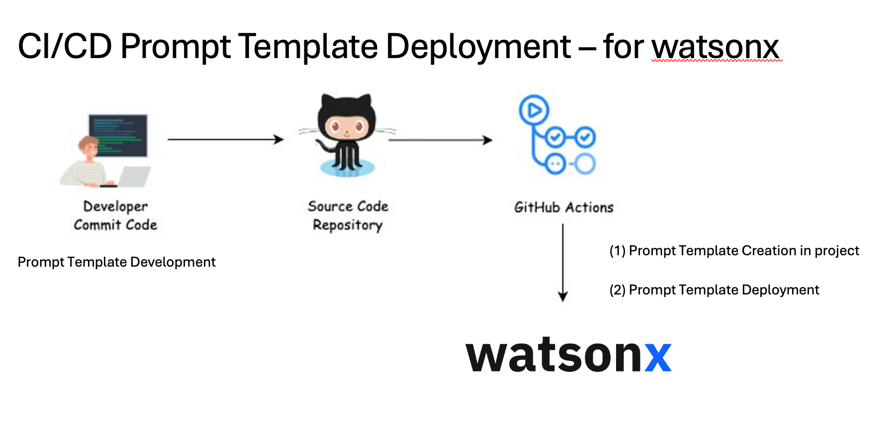

## 🚀 CI/CD with GitHub Actions Workflows: Deploying automatically Watsonx Prompt Templates

This workflow automatically runs the Python script python-scripts/python-script-watsonx-prompt-deployment.py 
whenever changes are pushed to the main branch or when manually triggered.
It is designed to deploy Watsonx prompt templates using credentials securely stored in GitHub Secrets.

### Prerequisites

Make sure you have stored the following variables as **GitHub repository secrets**:

- `WATSONX_API_KEY`
- `WATSONX_URL`
- `WATSONX_PROJECT_ID`
- `WATSONX_TASK_CREDENTIAL`

## 📌 What the CI/CD - Github Action Workflow does

### Triggers on:
Pushes to main
Manual execution via Workflow Dispatch

### Sets up the environment:
Checks out the repository
Installs Python 3.11
Installs dependencies from requirements.txt (if present)

### Runs the deployment script:
Executes python-script-watsonx-prompt-deployment.py

## 📌 What the Python Script does
( Leveraging watsonx.ai python sdk: https://ibm.github.io/watsonx-ai-python-sdk/v1.4.7/prompt_template_manager.html )

1. Library Import
2. Reads environment variables for API credentials, project ID, and task credentials.
3. Initializes a PromptTemplateManager for interacting with the Watsonx project.
4. Defines a prompt template with instructions, input variables, and example interactions.
5. Stores the prompt template in the specified project and unlocks it for editing.
6. Optionally updates the prompt template (commented out in the script).
7. Initializes the Watsonx AI API client and sets the default project.
6. Loads and lists existing prompt templates in the project.
7. Creates or retrieves user task credentials for secure API access.
8. Lists existing deployments before deployment.
9. Defines deployment metadata with a unique serving name.
10. Deploys the stored prompt template as an AI service in Watsonx.
11. Lists all deployments after deployment and prints deployment details.
12. The script is designed for CI/CD pipelines, allowing automated prompt template deployment and management within IBM Watsonx AI.

## ⚙️ Workflow Overview

